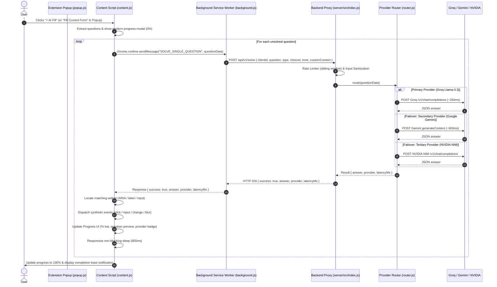

# AutoForm AI v2.0 Architecture & Design Specification

AutoForm AI v2.0 is a production-ready, zero-configuration form automation ecosystem consisting of a universal browser extension (MV3) and an intelligent multi-provider backend proxy.

---

## 1. System Architecture Diagram

---

## 2. Component Breakdown

### 1. `server/` (Production Multi-Provider Proxy)
- **Zero Client Keys:** API keys reside exclusively in server environment variables.
- **Provider Adapters:**
  - `src/providers/groq.js`: High-speed Llama 3.3 inference (~200-300ms).
  - `src/providers/gemini.js`: Google Gemini 2.5 Flash Lite multimodal reasoning.
  - `src/providers/nvidia.js`: NVIDIA NIM enterprise hosted models.
- **Failover Router (`src/services/router.js`):** Automatically detects `429`/`503`/timeout errors and tries alternative providers in priority order without user intervention.
- **Sliding-Window Rate Limiter (`src/middleware/rateLimiter.js`):** Manages per-client hourly quotas with automatic memory cleanup.

### 2. `src/content/content.js` (DOM Engine & UI)
- **Resilient ARIA Selector Strategy:** Queries `div[role="listitem"]`, `[role="heading"]`, and `[role="radio"]` / `[role="checkbox"]` with `data-value` resolution to survive Google Forms theme changes.
- **Modern Progress Overlay:** Displays live percentage completion, current question snippet, and active provider badge.
- **Cancellation:** Supports immediate cancellation via the overlay button, floating button, popup, or `Escape` key.

### 3. `src/popup/` (User Interface)
- **Zero-Config Dashboard:** Automatically detects active Google Forms with real-time question count badges.
- **Tone & Persona Customization:** Allows users to adjust answer verbosity and custom context.
- **Custom Server Support:** Expandable settings allow pointing the extension to any hosted proxy or switching to direct BYOK mode.

---

## 3. Communication Protocols

| Message Action | Source | Target | Payload | Response |
|:---|:---|:---|:---|:---|
| `START_SOLVING` | Popup | Content | `{}` | `{ success: true, isSolving: true }` |
| `STOP_SOLVING` | Popup | Content | `{}` | `{ success: true, isSolving: false }` |
| `GET_SOLVER_STATUS` | Popup | Content | `{}` | `{ isSolving: boolean, questionCount: number }` |
| `CHECK_SERVER_HEALTH` | Popup | Background | `{}` | `{ success: boolean, data: object }` |
| `SOLVE_SINGLE_QUESTION` | Content | Background | `{ id, question, type, choices }` | `{ success: true, answer, answers, provider, latencyMs }` |
