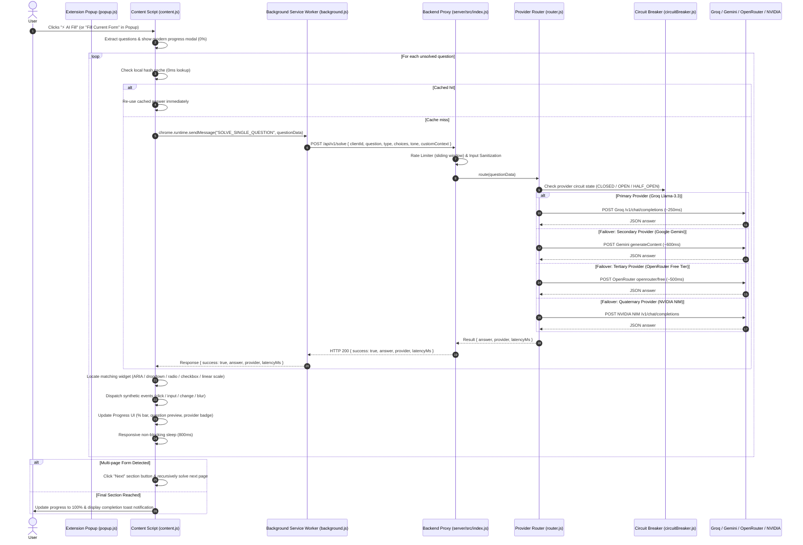

# AutoForm AI v2.0 Architecture & Design Specification

AutoForm AI v2.0 is a production-ready, zero-configuration form automation ecosystem consisting of a universal browser extension (MV3) and an intelligent multi-provider backend proxy.

---

## 1. System Architecture Diagram

---

## 2. Component Breakdown

### 1. `server/` (Production Multi-Provider Proxy)
- **Zero Client Keys:** API keys reside exclusively in server environment variables.
- **Provider Adapters:**
  - `src/providers/groq.js`: High-speed Llama 3.3 inference (~200-300ms).
  - `src/providers/gemini.js`: Google Gemini 2.5 Flash Lite multimodal reasoning (`x-goog-api-key` header auth).
  - `src/providers/openrouter.js`: OpenRouter dynamic free-tier auto-routing (`openrouter/free`).
  - `src/providers/nvidia.js`: NVIDIA NIM enterprise hosted models.
- **Circuit Breaker Engine (`src/services/circuitBreaker.js`):** 3-state breaker (`CLOSED`, `OPEN`, `HALF_OPEN`) preventing cascading latency spikes during upstream outages with 30s canary auto-recovery.
- **Key Rotator with 429 Cooldowns (`src/providers/base.js`):** Auto-detects rate-limit spikes, isolates exhausted keys with exponential backoff, and shifts traffic to healthy keys instantly.
- **Sliding-Window Rate Limiter (`src/middleware/rateLimiter.js`):** Manages per-client hourly quotas with unreferenced cleanup timers.
- **Hardened HTTP Layer (`src/index.js`):** `X-Request-Id` UUID tracing, HSTS, `nosniff`, `DENY` frames, `/healthz` liveness probes, and graceful SIGTERM connection draining.

### 2. `src/services/formAdapters.js` (Universal Form Engine)
- **Universal Multi-Platform Support:** Dynamically routes between specialized adapters based on host domain and DOM structure:
  - `GoogleFormsAdapter`: Material Design cards, `[role="listbox"]` quantumWiz dropdowns, custom "Other: [___]" text inputs, linear scales, and multi-page buttons.
  - `GreenhouseAdapter`: Greenhouse ATS (`boards.greenhouse.io`, `/jobs/`), applicant fields, custom questions, and file attachment handling.
  - `LeverAdapter`: Lever ATS (`jobs.lever.co`), bracketed inputs (`urls[LinkedIn]`, `cards[...]`), and `.application-question` containers.
  - `GenericJobFormAdapter`: Workday, Ashby, BambooHR, and standard HTML `<form>` pages. Groups radio buttons by `name`/fieldset, handles native `<select>`, and groups checkboxes.
- **10-Tier Cascading Label Resolution:** Resolves question text via `label[for]`, wrapping `<label>`, `aria-label`, `aria-labelledby`, fieldset `<legend>`, section container headers, placeholder text, and camelCase/snake_case attribute humanization.
- **Modern Framework Synthetic Event Dispatcher:** React 16/17/18, Vue, and Angular override HTML input property setters. The engine dispatches native prototype descriptors (`HTMLInputElement.prototype.value` / `HTMLTextAreaElement.prototype.value`) followed by synthetic `input`, `change`, and `blur` events to ensure reactive state synchronization.

### 3. `src/content/content.js` (DOM Engine & UI)
- **Pluggable Form Orchestration:** Delegates form discovery, title extraction, question scraping, and answer filling to `AutoFormEngine`.
- **Zero Footprint on Non-Form Pages:** Floating Action Button (FAB) only mounts when fillable questions are detected ($\ge 1$ question).
- **Draggable Floating Action Button (FAB):** Pointer events with `setPointerCapture`, >5px drag threshold, magnetic spring edge-snapping, and persistent coordinate memory (`sessionStorage`).
- **Client-Side Answer Hash Cache:** Deterministic question signature hashing for instant 0ms responses on repeated prompts.
- **Multi-Page Section Advance:** Automatically detects Google Forms multi-page "Next" buttons and seamlessly traverses section breaks.
- **Modern Micro-Animations:** GPU-accelerated CSS spring physics, light sweeps, card spotlights, and `prefers-reduced-motion` compliance.

### 4. `src/popup/` (User Interface)
- **Universal ATS & Form Detection:** Automatically detects Google Forms, Greenhouse, Lever, or generic job applications with dynamic badges.
- **Tone & Persona Customization:** Allows users to adjust answer verbosity and custom context.
- **Tactile Micro-Interactions:** Smooth spring feedback on button click and subtle hover light sweeps.

### 4. `.github/workflows/` (Automated CI/CD Pipeline)
- **`ci.yml`**: Matrix test suite (Node 18, 20, 22), manifest validation, extension packaging verification, and Docker container build tests.
- **`release.yml`**: Tag-triggered release pipeline packaging cross-browser bundles (Chrome, Edge, Firefox) and publishing GitHub Releases.

---

## 3. Communication Protocols

| Message Action | Source | Target | Payload | Response |
|:---|:---|:---|:---|:---|
| `START_SOLVING` | Popup | Content | `{}` | `{ success: true, isSolving: true }` |
| `STOP_SOLVING` | Popup | Content | `{}` | `{ success: true, isSolving: false }` |
| `GET_SOLVER_STATUS` | Popup | Content | `{}` | `{ isSolving: boolean, questionCount: number }` |
| `CHECK_SERVER_HEALTH` | Popup | Background | `{}` | `{ success: boolean, data: object }` |
| `SOLVE_SINGLE_QUESTION` | Content | Background | `{ id, question, type, choices }` | `{ success: true, answer, answers, provider, latencyMs }` |
